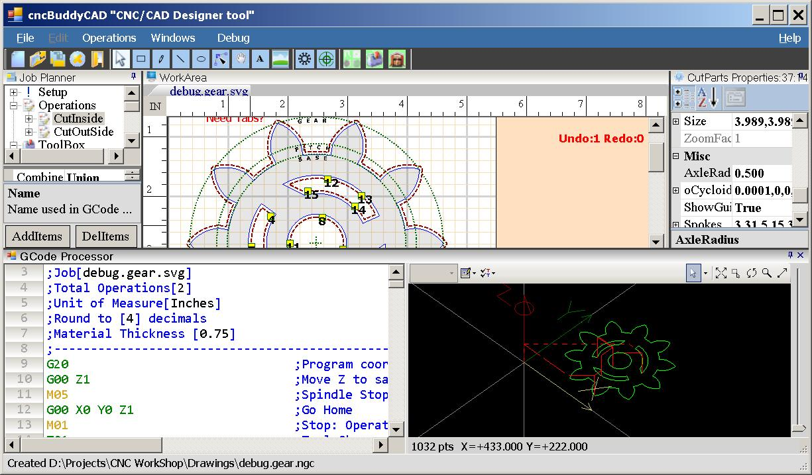
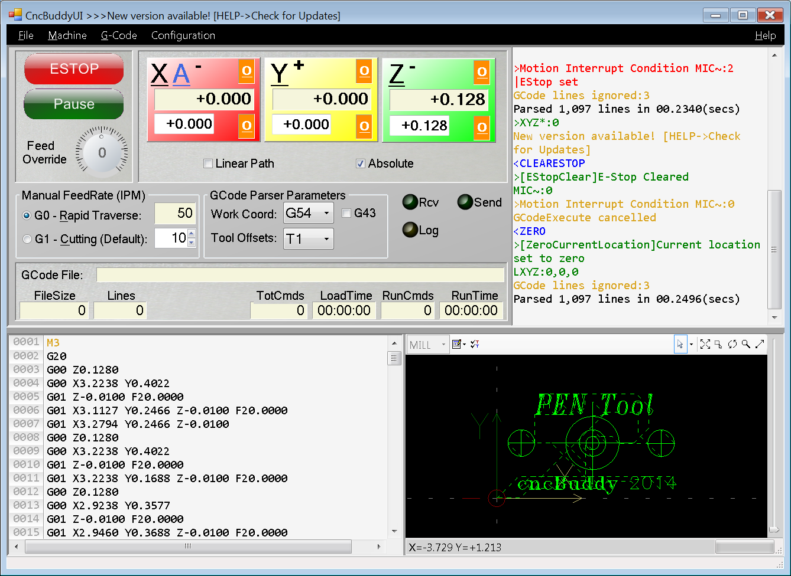

<H3>CNC 3 Axis software suite</H3>
* cncBuddyCAD: Windows CNC/CAD Designer program
<table align="center">
    <tr>
        <td align="center">Job Manager (Operations,Tools,Materials)</td>
        <td align="center">Cut order optimizer</td>
    </tr>
    <tr>
        <td align="center">G-Code editor</td>
        <td align="center">3D WireFrame viewer</td>
    </tr>
    <tr>
        <td align="center">Tabs generator (Perimeter & Radial)</td>
    </tr>
</table>

* cncBuddyCAMUI: Windows G-Code parser/interpreting master control program. 
  - Fully configurable 4 stepper motor (X,Y,Z,A)
  - Netduino+2 network(IP/Port) discovery
  - Workspace / Tool Offsets
  - InchesPerMinute Calibration
  - 3D Path Viewer
  - Jogging devices(Analog NESController,Analog Joystick,Keyboard)
  - Audible speech command responses
  - Binary file transfers
  - Color coded response messages (Red=Errors, Yellow=Warnings, Green=Info)

* cncBuddyCAM: Netduino+2 controller
  - GPIO control up to 4 stepper motors
  - UDP broadcast IPAddress/Port for discovery
  - G-Code processor
  - SDCard job caching
  - X,Y,Z axis JogMode
    - Analog devices: NESControl or Joystick 
    - PC keyboard 

-----------------------
<h4>Configuration</h4>
* General
  - Netduino+2 IP address & Port (default Port:80)
  - Feed Rates
  - G-Code Header/Footer files
* Axis Settings: X,Y,Z
  - Steps per Turn
  - Turns per Inch
  - Inverted signals
  - Slave A axis
* Netduino+2: X,Y,Z, A (slaved)
  - GPIO pins: Step / Direction / Limit Switch
* 3D Path Viewer
  - Enable / Speed / Zoom / Cut Diameter

-----------------------
<h4>Installation</h4>
- Download the zip archive and unpack or git-clone the project. The \bin folder contains the application files.
- \bin\cncBuddyCAM.hex is a Netduino+2 image for .NET Micro Framework SDK v4.2.2.  You must run MFDeploy.exe to load the hex image onto your Netduino+2. Once the cncBuddyCAM.hex image is loaded...
  - Make sure the device is responding: 
    - Optional: You may have to restart TinyClr from the menu "Plug-In->Debug->Reboot CLR".
    - Select Device type = "USB" and name "NetduinoPlus2_Netduino".
    - Click "PING" button should display message "Pinging... TinyCLR".
  - Set your network configuration parameters "Target->Configuration->Network".
    - Optional: You may have to restart TinyClr from the menu "Plug-In->Debug->Reboot CLR".
- \bin\cncBuddyUI.exe is a Windows ready-to-run program on the .Net4.0 framework
 
-----------------------
<h4>Getting started</h4>
- cncBuddyCAM:
  - Blue LED 5 rapid flashes means waiting for a network connection to cncBuddyUI.
    - The ONBOARD_SW1 button (typically used for rebooting) is re-configured for use as an "ESTOP" button (Safety1st).
    - At start up, software always defaults to an "ESTOP" condition (Safety1st)!
- cncBuddyUI:
  - Set all operating parameters in menu "Machine->Configuration Settings". Clicking the "Save" button:
    1. settings are sent to cncBuddyCAM for re-configuration
    2. "RPTSTATUS" response is always returned for verification
    3. settings are stored locally on your hard drive to be used during next startup.
  - At start up, we always produce an "ESTOP" condition! Any/All errors must be resolved before you can Reset/Clear an "ESTOP" (Safety1st).
  - Audible beeps are used during "ESTOP" conditions and error detection.
  - Command line options (prefixed by "-","--", or "/"):

<pre><code>
cncBuddyUI.exe [/help|/?] [/reset] [/discover] [/install:[axisA=X|Y][,port=9999][,limitsw=true|false]] 

/help|/?    Show this help/usage information
/reset      Create new default software configuration
/discover   Listen for cncBuddyCAM broadcasting IPAddress & Port (timeout 30 secs)
/install    Install hardware specific settings on Netduino+2 SDCard. Overrides software configuration values
   port     Network port number (default=80)
   axisA    Slave axisA motor signals to X or Y axis
   limitsw  Limit switches are installed and active on X,Y,Z axis

Example: cncBuddyUI.exe /install:"axisA=X,port=4512,limitsw=true"
</code></pre>

-----------------------
<h4>ESTOP</h4>

ESTOP conditions are stored internally as Motion Interrupt Flags(MIC). The MIC value can be any combination:

<table align="center" style="font-size:10pt">
    <tr>
        <th align="center">##</th>
        <th align="center">Description</th>
    </tr>
    <tr>
        <td align="center">01</td>
        <td align="left">PAUSE button</td>
    </tr>
    <tr>
        <td align="center">02</td>
        <td align="left">ESTOP button</td>
    </tr>
    <tr>
        <td align="center">04</td>
        <td align="left">OVERTRAVEL - limit switch detected</td>
    </tr>
    <tr>
        <td align="center">08</td>
        <td align="left">CLIENTSOCKETNOTREADY - network connection not ready/available</td>
    </tr>
     <tr>
        <td align="center">16</td>
        <td align="left">CONFIGERROR - configuration error</td>
    </tr>
</table>
-----------------------
<h4>Development</h4>

I've built a couple CNC machines which rely heavily on this project for their day to day use.  I'm dedicated to growing it's base whether applying bug fixes, performance tuning, or adding features.

Feel free to file <a href="https://github.com/osstekz/cncBuddy/issues">enhancements, issues, and change requests</a>.

Development and testing use the .NET Micro Framework SDK v4.2.2

If you find this software useful, want to say thanks and encourage development, please consider a 
<a href="https://www.paypal.me/GeorgeAslanis">donation</a>.

-----------------------

<h4>Requested Features</h4>
<ul>
	<li>DirectX/OpenGL "Hardware accelerated graphics"</li>
	<li>Import DXF format</li>
	<li>AndroidUI Controller</li>
</ul>

<i>*Contributions by the great work of Darrin Howell's <a href="http://forums.netduino.com/index.php?/topic/2892-my-netduino-cnc-machine/">DazCam</a> project</i>

